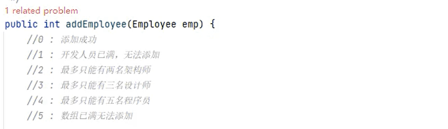

com.atguigu.ems.domain: 实体包 ，包含所有实体类 ：javabean
Employee
id
name
age
salary

programmer
designer
    bonus
architect
    stock


com.atguigu.ems.service: 管理包 ，服务包， 核心业务逻辑类
EmployeeService
增加员工修改



com.atguigu.ems.view: 视图包，UI模块，负责和用户交互
EmployeeView
EMSUtility

com.atguigu.ems.main: 项目入口
EmployeeMain
main()
```
标题    